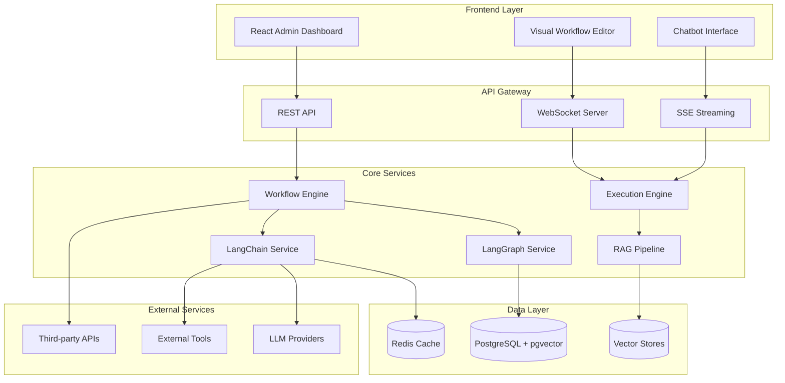

# AI Agents Workflow Architecture & Implementation Plan

## Executive Summary

This document outlines the comprehensive architecture and implementation plan for transforming our existing workflow system into an enterprise-grade agentic AI workflow platform with capabilities matching industry leaders while leveraging our unique strengths in multi-tenancy, ABAC authorization, and hierarchical organizations.

## Table of Contents

1. [Current State Analysis](#current-state-analysis)
2. [Target Architecture](#target-architecture)
3. [Technical Design](#technical-design)
4. [Implementation Roadmap](#implementation-roadmap)
5. [Database Schema](#database-schema)
6. [Node Library Architecture](#node-library-architecture)
7. [Integration Patterns](#integration-patterns)
8. [Security & Compliance](#security-compliance)
9. [Performance Targets](#performance-targets)
10. [Risk Mitigation](#risk-mitigation)

## Current State Analysis

### Existing Implementation (~80% Complete)

#### ✅ Already Implemented
- **Backend Infrastructure** (`apps/backend/src/modules/ai-workflows/`)
  - Complete database schema with React Flow graph structure
  - CRUD services for workflow management
  - Queue-based execution with Bull/Redis
  - Event-driven architecture with NestJS EventEmitter
  
- **Frontend Implementation** (`apps/admin-dashboard/`)
  - React Flow based visual editor
  - Drag-and-drop node palette
  - 25+ pre-built node types
  - Node properties configuration panel

- **Multi-Agent System** (`.claude/agents/`)
  - 130+ specialized agents across 10 categories
  - Agent specification and orchestration framework

#### 🔧 Gaps to Address
- LangGraph integration for complex agent workflows
- Advanced RAG capabilities
- Vector database integrations
- Real-time collaborative editing
- Workflow marketplace/templates
- Advanced monitoring and observability

## Target Architecture

### System Overview



### Core Components

#### 1. **Workflow Engine**
- Graph compilation and validation
- Node dependency resolution
- Execution planning
- State management

#### 2. **Execution Engine**
- Streaming execution with backpressure
- Parallel node processing
- Error recovery and retry
- Checkpoint management

#### 3. **LangGraph Integration**
- StateGraph for complex workflows
- Conditional edges and cycles
- Checkpointing for persistence
- Graph compilation optimization

#### 4. **LangChain Integration**
- 30+ node categories
- Chain and agent orchestration
- Tool and function calling
- Memory management

#### 5. **RAG Pipeline**
- Document ingestion and processing
- Text chunking strategies
- Embedding generation
- Vector similarity search
- Context window optimization

## Technical Design

### Workflow JSON Schema

```typescript
interface WorkflowDefinition {
  id: string;
  version: string;
  metadata: {
    name: string;
    description: string;
    category: 'chat' | 'agent' | 'rag' | 'automation' | 'analysis';
    tags: string[];
    author: string;
    organizationId: string;
  };
  
  nodes: Array<{
    id: string;
    type: string; // Maps to node implementation
    position: { x: number; y: number };
    data: {
      label: string;
      inputs: Record<string, any>;
      outputs: Record<string, any>;
      config: {
        credentials?: string[];
        timeout?: number;
        retries?: number;
        cache?: boolean;
      };
    };
    state?: any; // Runtime state
  }>;
  
  edges: Array<{
    id: string;
    source: string;
    sourceHandle?: string;
    target: string;
    targetHandle?: string;
    type: 'default' | 'conditional' | 'loop';
    data?: {
      condition?: ConditionExpression;
      label?: string;
      priority?: number;
    };
  }>;
  
  flowState: Record<string, any>; // Shared state
  variables: Record<string, Variable>;
  credentials: string[]; // Required credential IDs
  
  execution: {
    timeout?: number;
    maxRetries?: number;
    checkpointing?: boolean;
    streaming?: boolean;
  };
  
  chatbot?: {
    enabled: boolean;
    config: ChatbotConfig;
  };
}
```

### Node Architecture

```typescript
// Base node structure
abstract class BaseWorkflowNode {
  // Metadata
  static nodeDefinition: INodeData;
  
  // Lifecycle methods
  abstract initialize(context: NodeContext): Promise<void>;
  abstract execute(input: any, context: NodeContext): Promise<NodeResult>;
  abstract cleanup(context: NodeContext): Promise<void>;
  
  // Utilities
  protected resolveVariables(text: string, context: NodeContext): string;
  protected getCredentials(type: string): Promise<Credentials>;
  protected emitProgress(progress: number, message?: string): void;
}

// Node categories hierarchy
WorkflowNodes/
├── Triggers/
│   ├── ManualTrigger
│   ├── WebhookTrigger
│   ├── ScheduleTrigger
│   └── EventTrigger
├── LLM/
│   ├── OpenAIChat
│   ├── AnthropicClaude
│   ├── GoogleGemini
│   └── CustomLLM
├── Agents/
│   ├── OpenAIFunctionsAgent
│   ├── ReActAgent
│   ├── PlanExecuteAgent
│   └── SequentialAgent
├── Chains/
│   ├── LLMChain
│   ├── ConversationChain
│   ├── RetrievalQAChain
│   └── SQLChain
├── Memory/
│   ├── ConversationBufferMemory
│   ├── ConversationSummaryMemory
│   ├── VectorStoreMemory
│   └── EntityMemory
├── Tools/
│   ├── APITool
│   ├── WebBrowserTool
│   ├── CalculatorTool
│   └── CustomFunctionTool
├── VectorStores/
│   ├── PineconeNode
│   ├── WeaviateNode
│   ├── QdrantNode
│   └── PGVectorNode
├── Documents/
│   ├── PDFLoader
│   ├── CSVLoader
│   ├── WebScraper
│   └── DatabaseLoader
├── TextProcessing/
│   ├── RecursiveSplitter
│   ├── TokenSplitter
│   └── SemanticSplitter
├── Logic/
│   ├── ConditionNode
│   ├── LoopNode
│   ├── SwitchNode
│   └── MergeNode
└── Actions/
    ├── DatabaseQuery
    ├── HTTPRequest
    ├── EmailSender
    └── TaskCreator
```

## Implementation Roadmap

### Phase 1: Core Infrastructure (Weeks 1-3) ✅ COMPLETED

#### Database Schema Enhancement ✅
- [x] Enhanced workflow schema with LangGraph support
- [x] Workflow templates and versioning tables
- [x] Vector embeddings with pgvector
- [x] Conversation history and memory storage
- [x] Metrics and analytics tables

#### Core Services ✅
- [x] LangGraph integration service
- [x] Enhanced execution engine with streaming
- [x] Base node classes and interfaces
- [x] State management service

### Phase 2: LangChain Integration (Weeks 4-6) 🚧 IN PROGRESS

#### Node Library Implementation
- [ ] **LLM Nodes** (Week 4)
  - OpenAI GPT-4/3.5
  - Anthropic Claude
  - Google Gemini
  - Azure OpenAI
  - Local models (Ollama)

- [ ] **Chain Nodes** (Week 4)
  - LLMChain
  - ConversationChain
  - RetrievalQAChain
  - SequentialChain
  - TransformChain

- [ ] **Agent Nodes** (Week 5)
  - OpenAI Functions Agent
  - ReAct Agent
  - Plan-and-Execute Agent
  - SQL Agent
  - Custom tool-calling agents

- [ ] **Memory Nodes** (Week 5)
  - ConversationBufferMemory
  - ConversationSummaryMemory
  - VectorStoreMemory
  - EntityMemory
  - Token buffer memory

- [ ] **Tool Nodes** (Week 6)
  - API tool from OpenAPI
  - Web browser tool
  - Calculator
  - Python interpreter
  - Custom functions

### Phase 3: RAG Pipeline (Weeks 7-8)

#### Document Processing
- [ ] **Document Loaders**
  - PDF, CSV, JSON, TXT, Markdown
  - Web scraper
  - Database loader
  - API data loader
  - GitHub repository loader

- [ ] **Text Splitters**
  - Recursive character splitter
  - Token-based splitter
  - Semantic splitter
  - Custom regex splitter

- [ ] **Embedding Generation**
  - OpenAI embeddings
  - Cohere embeddings
  - HuggingFace models
  - Custom embedding models

#### Vector Storage
- [ ] **Vector Store Integrations**
  - Pinecone
  - Weaviate
  - Qdrant
  - ChromaDB
  - PostgreSQL with pgvector
  - Redis vector search

- [ ] **Retrieval Strategies**
  - Similarity search
  - MMR (Maximum Marginal Relevance)
  - Hybrid search (keyword + semantic)
  - Metadata filtering
  - Re-ranking

### Phase 4: Advanced Features (Weeks 9-10)

#### Flow Control
- [ ] **Advanced Logic**
  - AI-driven conditional routing
  - Loop with convergence criteria
  - Parallel execution branches
  - Sub-workflow execution
  - Human-in-the-loop approvals

- [ ] **Error Handling**
  - Retry strategies
  - Fallback nodes
  - Error recovery workflows
  - Dead letter queues

#### Optimization
- [ ] **Performance**
  - Response caching
  - Batch processing
  - Lazy loading
  - Connection pooling
  - Query optimization

- [ ] **Cost Management**
  - Token usage tracking
  - Cost estimation
  - Budget limits
  - Model selection optimization

### Phase 5: Enterprise Features (Weeks 11-12)

#### Security & Compliance
- [ ] **Authentication & Authorization**
  - Workflow-level permissions
  - Node-level access control
  - Credential encryption
  - API key rotation
  - Audit logging

- [ ] **Data Privacy**
  - PII detection and masking
  - Data retention policies
  - GDPR compliance
  - Data anonymization

#### Collaboration
- [ ] **Team Features**
  - Workflow sharing
  - Version control
  - Comments and annotations
  - Real-time collaboration
  - Approval workflows

- [ ] **Template Marketplace**
  - Public templates
  - Organization templates
  - Template versioning
  - Usage analytics
  - Rating system

### Phase 6: UI/UX Enhancements (Weeks 13-14)

#### Visual Editor
- [ ] **Canvas Improvements**
  - Node search and filtering
  - Minimap navigation
  - Undo/redo with history
  - Copy/paste subgraphs
  - Keyboard shortcuts
  - Snap to grid
  - Auto-layout

- [ ] **Node Management**
  - Node grouping
  - Node templates
  - Bulk operations
  - Node versioning
  - Custom node colors

#### Debugging & Testing
- [ ] **Development Tools**
  - Step-through debugger
  - Variable inspector
  - Execution timeline
  - Performance profiler
  - Mock data injection
  - Test data sets

- [ ] **Monitoring**
  - Real-time execution view
  - Node metrics
  - Error tracking
  - Log aggregation
  - Custom dashboards

#### Chatbot Interface
- [ ] **Chat Features**
  - Embedded widget
  - Conversation history
  - File uploads
  - Voice input/output
  - Multi-language support
  - Custom themes

## Database Schema

### Core Tables (Enhanced)

```sql
-- Enhanced workflow table
ALTER TABLE ai_workflows ADD COLUMN IF NOT EXISTS (
  category VARCHAR(50),
  tags TEXT[],
  flow_state JSONB,
  variables JSONB,
  chatbot_config JSONB
);

-- Workflow templates
CREATE TABLE workflow_templates (
  id UUID PRIMARY KEY,
  name VARCHAR(255),
  description TEXT,
  category VARCHAR(50),
  tags TEXT[],
  icon VARCHAR(100),
  flow_definition JSONB,
  input_schema JSONB,
  output_schema JSONB,
  required_credentials JSONB,
  is_public BOOLEAN DEFAULT false,
  usage_count INTEGER DEFAULT 0,
  organization_id UUID REFERENCES organizations(id),
  created_by_id UUID REFERENCES users(id),
  metadata JSONB,
  created_at TIMESTAMP DEFAULT CURRENT_TIMESTAMP,
  updated_at TIMESTAMP DEFAULT CURRENT_TIMESTAMP
);

-- Vector embeddings for RAG
CREATE TABLE vector_embeddings (
  id UUID PRIMARY KEY,
  organization_id UUID REFERENCES organizations(id),
  workflow_id UUID REFERENCES ai_workflows(id),
  document_id UUID REFERENCES workflow_documents(id),
  content TEXT,
  embedding vector(1536),
  metadata JSONB,
  chunk_index INTEGER,
  total_chunks INTEGER,
  created_at TIMESTAMP DEFAULT CURRENT_TIMESTAMP
);

-- Conversation history
CREATE TABLE conversation_history (
  id UUID PRIMARY KEY,
  session_id VARCHAR(255),
  workflow_id UUID REFERENCES ai_workflows(id),
  organization_id UUID REFERENCES organizations(id),
  user_id UUID REFERENCES users(id),
  role VARCHAR(20), -- user, assistant, system, function
  content TEXT,
  metadata JSONB, -- token count, model, etc.
  created_at TIMESTAMP DEFAULT CURRENT_TIMESTAMP
);

-- Workflow metrics
CREATE TABLE workflow_metrics (
  id UUID PRIMARY KEY,
  workflow_id UUID REFERENCES ai_workflows(id),
  execution_id UUID REFERENCES workflow_executions(id),
  metric_type VARCHAR(50), -- token_usage, latency, cost, error_rate
  value DECIMAL(10,4),
  unit VARCHAR(20),
  node_id VARCHAR(100),
  metadata JSONB,
  timestamp TIMESTAMP DEFAULT CURRENT_TIMESTAMP
);

-- Indexes for performance
CREATE INDEX idx_vector_embeddings_embedding ON vector_embeddings 
  USING ivfflat (embedding vector_cosine_ops) WITH (lists = 100);
CREATE INDEX idx_conversation_history_session ON conversation_history(session_id);
CREATE INDEX idx_workflow_metrics_workflow ON workflow_metrics(workflow_id, metric_type);
```

## Comprehensive Integration Support

### LLM Providers (40+ Supported)

#### Cloud Providers
- **OpenAI**: GPT-4, GPT-3.5, GPT-4 Vision, DALL-E 3
- **Anthropic**: Claude 3 (Opus, Sonnet, Haiku), Claude 2
- **Google**: Gemini Pro, Gemini Pro Vision, PaLM 2
- **Azure**: Azure OpenAI Service (all models)
- **AWS**: Bedrock (Claude, Llama, Titan)
- **Cohere**: Command, Command-R
- **MistralAI**: Mistral Large, Medium, Small
- **Groq**: LPU optimized models
- **Together AI**: 100+ open-source models
- **Replicate**: Community models
- **HuggingFace**: Inference API & Endpoints

#### Local Model Support
- **Ollama**: 100+ models (Llama, Mistral, Phi, etc.)
- **LocalAI**: OpenAI-compatible local API
- **LM Studio**: Desktop app integration
- **Text Generation WebUI**: Oobabooga integration
- **Custom Endpoints**: Any OpenAI-compatible API

#### Extended Support via Proxy
- **LiteLLM Proxy**: 100+ additional providers
- **OpenRouter**: Unified API for multiple providers
- **Anyscale**: Ray-based model serving

### Vector Databases (19+ Supported)

#### Cloud-Native
- **Pinecone**: Managed vector database
- **Weaviate**: GraphQL-based vector search
- **Qdrant**: High-performance similarity search
- **Milvus/Zilliz**: Scalable similarity search
- **MongoDB Atlas**: Vector search capability
- **Supabase**: PostgreSQL with pgvector
- **Upstash**: Serverless vector database
- **Astra DB**: DataStax Cassandra-based

#### Self-Hosted
- **ChromaDB**: Lightweight embedding database
- **FAISS**: Facebook AI similarity search
- **PostgreSQL + pgvector**: Native PostgreSQL extension
- **Elasticsearch**: Full-text + vector search
- **Redis**: Vector similarity search
- **Vectara**: Managed RAG platform
- **SingleStore**: Distributed SQL with vectors
- **ClickHouse**: OLAP with vector support
- **TypeSense**: Typo-tolerant search
- **LanceDB**: Embedded vector database

### Tool Integrations (30+ Categories)

#### Search & Web
- **Search Engines**: Google, Brave, Serper, SerpAPI, Bing
- **Web Scraping**: Cheerio, Playwright, Puppeteer
- **Web Crawling**: Firecrawl, Apify
- **News**: Google News, NewsAPI

#### APIs & Services
- **REST API**: Generic REST endpoint calls
- **OpenAPI**: Automatic tool generation from specs
- **GraphQL**: Query execution
- **Webhook**: Incoming/outgoing webhooks

#### Communication
- **Email**: SMTP, SendGrid, Mailgun
- **Slack**: Messages, channels, workflows
- **Discord**: Bot integration
- **Telegram**: Bot API
- **WhatsApp**: Business API

#### Databases
- **SQL**: PostgreSQL, MySQL, SQLite, MSSQL
- **NoSQL**: MongoDB, DynamoDB, Firestore
- **Graph**: Neo4j, ArangoDB
- **Time-series**: InfluxDB, TimescaleDB

#### File Operations
- **File System**: Read, Write, Append, Delete
- **Cloud Storage**: S3, GCS, Azure Blob
- **Document Processing**: Parse, Extract, Transform

#### Development Tools
- **Code Interpreter**: Python, JavaScript execution
- **Calculator**: Mathematical operations
- **JSON Parser**: Parse and manipulate JSON
- **Regex**: Pattern matching

### MCP (Model Context Protocol) Support

#### Native MCP Features
- **Server Implementation**: Built-in MCP server
- **Client Support**: Connect to external MCP servers
- **Tool Discovery**: Automatic tool registration
- **Schema Validation**: OpenRPC compliance

#### MCP Integrations
- **File System MCP**: Local file operations
- **Database MCP**: SQL operations
- **Web Search MCP**: Internet search
- **API MCP**: REST/GraphQL calls
- **Custom MCP**: User-defined servers

### Document Loaders (40+ Formats)

#### File Formats
- **Documents**: PDF, DOCX, TXT, RTF, ODT
- **Spreadsheets**: CSV, XLSX, TSV
- **Presentations**: PPTX, ODP
- **Code**: All programming languages
- **Data**: JSON, XML, YAML, TOML
- **Ebooks**: EPUB, MOBI
- **Images**: OCR support for JPG, PNG, TIFF

#### Web Sources
- **Websites**: URL, Sitemap, RSS
- **GitHub**: Repositories, Issues, PRs
- **GitLab**: Projects, Wiki
- **Notion**: Pages, Databases
- **Confluence**: Spaces, Pages
- **Slack**: Channels, Messages

#### Cloud Services
- **Google Drive**: Docs, Sheets, Slides
- **OneDrive**: Microsoft 365 documents
- **Dropbox**: File sync
- **Box**: Enterprise content

#### Databases
- **SQL Databases**: Query results
- **NoSQL**: Document extraction
- **APIs**: REST, GraphQL responses

### Embedding Providers (15+ Options)

#### Cloud Embeddings
- **OpenAI**: text-embedding-3, ada-002
- **Cohere**: embed-v3
- **Google**: Gecko, Universal Sentence Encoder
- **Azure**: OpenAI embeddings
- **HuggingFace**: Inference API
- **Voyage AI**: Specialized embeddings
- **Together AI**: Open-source embeddings

#### Local Embeddings
- **Ollama**: Local embedding models
- **LocalAI**: Self-hosted embeddings
- **Sentence Transformers**: All-MiniLM, etc.
- **Custom Models**: User-provided models

### Observability & Monitoring

#### APM Tools
- **LangSmith**: LangChain native monitoring
- **LangFuse**: Open-source LLM observability
- **Lunary**: AI application monitoring
- **LangWatch**: Performance tracking
- **Helicone**: LLM analytics
- **Portkey**: Gateway with observability

#### Analytics
- **Token Usage**: Detailed tracking
- **Cost Analysis**: Per-model pricing
- **Latency Metrics**: Response times
- **Error Tracking**: Failure analysis

### Memory & Cache Systems

#### Memory Types
- **Redis/Valkey**: In-memory data store
- **MongoDB**: Document-based memory
- **DynamoDB**: AWS managed memory
- **Upstash**: Serverless Redis
- **Motorhead**: Managed memory service
- **Zep**: Long-term memory for LLMs

#### Cache Strategies
- **Semantic Cache**: Similar query matching
- **Exact Match Cache**: Identical queries
- **TTL-based**: Time-based expiration
- **LRU Cache**: Least recently used

## Node Library Architecture

### Flexible Provider System

```typescript
// Universal LLM Provider Interface
interface ILLMProvider {
  name: string;
  type: 'cloud' | 'local' | 'proxy';
  models: string[];
  supportedFeatures: {
    streaming: boolean;
    functionCalling: boolean;
    vision: boolean;
    embeddings: boolean;
  };
  
  initialize(config: any): Promise<void>;
  chat(messages: any[], options: any): Promise<any>;
  embed(text: string): Promise<number[]>;
  generateImage?(prompt: string): Promise<string>;
}

// Provider Registry
@Injectable()
export class LLMProviderRegistry {
  private providers = new Map<string, ILLMProvider>();
  
  // Register all providers
  async initialize() {
    // Cloud providers
    this.registerProvider('openai', new OpenAIProvider());
    this.registerProvider('anthropic', new AnthropicProvider());
    this.registerProvider('google', new GoogleProvider());
    this.registerProvider('azure', new AzureProvider());
    
    // Local providers
    this.registerProvider('ollama', new OllamaProvider());
    this.registerProvider('localai', new LocalAIProvider());
    this.registerProvider('lmstudio', new LMStudioProvider());
    
    // Extended via proxy
    this.registerProvider('litellm', new LiteLLMProvider());
    this.registerProvider('custom', new CustomEndpointProvider());
  }
  
  getProvider(name: string): ILLMProvider {
    const provider = this.providers.get(name);
    if (!provider) {
      throw new Error(`Unknown provider: ${name}`);
    }
    return provider;
  }
  
  // Dynamic provider discovery
  async discoverLocalModels(): Promise<any[]> {
    const models = [];
    
    // Check Ollama
    try {
      const ollamaModels = await this.checkOllama();
      models.push(...ollamaModels);
    } catch (e) {}
    
    // Check LocalAI
    try {
      const localAIModels = await this.checkLocalAI();
      models.push(...localAIModels);
    } catch (e) {}
    
    return models;
  }
}
```

### Universal Vector Store Adapter

```typescript
// Vector Store Interface
interface IVectorStore {
  name: string;
  type: 'cloud' | 'self-hosted' | 'embedded';
  features: {
    hybridSearch: boolean;
    metadataFiltering: boolean;
    multiTenancy: boolean;
    backup: boolean;
  };
  
  initialize(config: any): Promise<void>;
  addDocuments(docs: Document[]): Promise<void>;
  similaritySearch(query: string, k: number, filter?: any): Promise<Document[]>;
  hybridSearch?(query: string, k: number): Promise<Document[]>;
  delete(ids: string[]): Promise<void>;
}

// Vector Store Factory
@Injectable()
export class VectorStoreFactory {
  async create(type: string, embeddings: any, config: any): Promise<IVectorStore> {
    switch (type) {
      // Cloud-native
      case 'pinecone':
        return new PineconeAdapter(embeddings, config);
      case 'weaviate':
        return new WeaviateAdapter(embeddings, config);
      case 'qdrant':
        return new QdrantAdapter(embeddings, config);
      
      // Self-hosted
      case 'chroma':
        return new ChromaAdapter(embeddings, config);
      case 'pgvector':
        return new PGVectorAdapter(embeddings, config);
      case 'elasticsearch':
        return new ElasticsearchAdapter(embeddings, config);
      
      // Local/embedded
      case 'faiss':
        return new FAISSAdapter(embeddings, config);
      case 'lancedb':
        return new LanceDBAdapter(embeddings, config);
      
      default:
        throw new Error(`Unknown vector store: ${type}`);
    }
  }
  
  // Auto-detect best available option
  async autoSelect(requirements: any): Promise<string> {
    // Check requirements and available services
    if (requirements.scale === 'enterprise' && requirements.managed) {
      return 'pinecone'; // or other cloud option
    }
    if (requirements.onPremise && requirements.sql) {
      return 'pgvector';
    }
    if (requirements.embedded && requirements.lightweight) {
      return 'faiss';
    }
    return 'chroma'; // default
  }
}
```

### MCP Integration Framework

```typescript
// MCP Server Implementation
@Injectable()
export class MCPServerService {
  private servers = new Map<string, MCPServer>();
  
  async registerServer(config: MCPServerConfig) {
    const server = new MCPServer({
      name: config.name,
      version: '1.0.0',
      description: config.description,
    });
    
    // Register tools
    for (const tool of config.tools) {
      server.addTool({
        name: tool.name,
        description: tool.description,
        parameters: tool.parameters,
        handler: tool.handler,
      });
    }
    
    // Register resources
    for (const resource of config.resources || []) {
      server.addResource({
        name: resource.name,
        uri: resource.uri,
        handler: resource.handler,
      });
    }
    
    await server.start();
    this.servers.set(config.name, server);
  }
  
  // Connect to external MCP servers
  async connectToMCPServer(url: string) {
    const client = new MCPClient();
    await client.connect(url);
    
    // Discover available tools
    const tools = await client.listTools();
    
    // Register as workflow nodes
    for (const tool of tools) {
      await this.registerMCPTool(tool);
    }
  }
  
  private async registerMCPTool(tool: any) {
    // Create dynamic node for MCP tool
    const node = {
      id: `mcp-${tool.name}`,
      label: tool.displayName,
      type: 'mcp-tool',
      category: 'tools',
      description: tool.description,
      inputs: this.convertMCPParams(tool.parameters),
      execute: async (input: any) => {
        return await this.executeMCPTool(tool.name, input);
      },
    };
    
    // Register with node registry
    await this.nodeRegistry.registerNode(node);
  }
}
```

### Node Implementation Pattern

```typescript
// Example: OpenAI Chat Node
import { Injectable } from '@nestjs/common';
import { ChatOpenAI } from '@langchain/openai';
import { HumanMessage, AIMessage } from '@langchain/core/messages';
import { BaseLLMNode, INodeExecutionContext, INodeExecutionResult } from '../base-node.class';

@Injectable()
export class OpenAIChatNode extends BaseLLMNode {
  static nodeDefinition = {
    id: 'openai-chat',
    label: 'OpenAI Chat',
    name: 'openAIChat',
    type: 'llm',
    category: 'ai',
    version: 1,
    description: 'Chat with OpenAI models',
    icon: '🤖',
    baseClasses: ['LLM', 'OpenAI'],
    inputs: [
      {
        label: 'Model',
        name: 'model',
        type: 'options',
        options: [
          { label: 'GPT-4', name: 'gpt-4' },
          { label: 'GPT-4 Turbo', name: 'gpt-4-turbo' },
          { label: 'GPT-3.5 Turbo', name: 'gpt-3.5-turbo' },
        ],
        default: 'gpt-3.5-turbo',
      },
      {
        label: 'System Message',
        name: 'systemMessage',
        type: 'string',
        rows: 4,
        optional: true,
      },
      {
        label: 'User Message',
        name: 'userMessage',
        type: 'string',
        rows: 4,
      },
      {
        label: 'Temperature',
        name: 'temperature',
        type: 'number',
        default: 0.7,
        optional: true,
      },
    ],
    credentials: [
      {
        label: 'OpenAI API',
        name: 'openAIApi',
        type: 'credential',
      },
    ],
    outputAnchors: [
      {
        id: 'output',
        label: 'Output',
        name: 'output',
        type: 'ChatMessage',
      },
    ],
  };

  async execute(
    input: any,
    context: INodeExecutionContext
  ): Promise<INodeExecutionResult> {
    try {
      // Get parameters
      const model = this.getParam('model', 'gpt-3.5-turbo');
      const systemMessage = this.getParam('systemMessage');
      const userMessage = this.resolveVariables(
        this.getParam('userMessage'),
        context
      );
      
      // Get credentials
      const credentials = await this.getCredentials('openAIApi');
      
      // Initialize LLM
      const llm = new ChatOpenAI({
        modelName: model,
        temperature: this.getParam('temperature', 0.7),
        openAIApiKey: credentials.apiKey,
        streaming: context.flowState.streaming || false,
        callbacks: context.callbacks,
      });

      // Prepare messages
      const messages = [];
      if (systemMessage) {
        messages.push(new SystemMessage(systemMessage));
      }
      messages.push(new HumanMessage(userMessage));

      // Execute
      const response = await llm.invoke(messages);
      
      // Calculate token usage
      const tokenUsage = {
        promptTokens: response.usage?.prompt_tokens || 0,
        completionTokens: response.usage?.completion_tokens || 0,
        totalTokens: response.usage?.total_tokens || 0,
      };

      // Calculate cost
      const cost = this.calculateCost(tokenUsage, model);

      return {
        output: response.content,
        variables: {
          lastResponse: response.content,
        },
        messages: [response],
        tokenUsage,
        cost,
        metadata: {
          model,
          temperature: this.getParam('temperature'),
        },
      };
    } catch (error) {
      return this.formatError(error);
    }
  }
}
```

### Node Registration System

```typescript
// Node registry service
@Injectable()
export class NodeRegistryService {
  private nodes = new Map<string, typeof BaseNode>();
  
  registerNode(nodeType: string, nodeClass: typeof BaseNode) {
    this.nodes.set(nodeType, nodeClass);
  }
  
  getNode(nodeType: string): typeof BaseNode {
    const NodeClass = this.nodes.get(nodeType);
    if (!NodeClass) {
      throw new Error(`Unknown node type: ${nodeType}`);
    }
    return NodeClass;
  }
  
  getAllNodes(): INodeData[] {
    return Array.from(this.nodes.values()).map(
      NodeClass => NodeClass.nodeDefinition
    );
  }
  
  getNodesByCategory(category: string): INodeData[] {
    return this.getAllNodes().filter(
      node => node.category === category
    );
  }
}
```

## Integration Patterns

### LangChain Integration

```typescript
// LangChain service wrapper
@Injectable()
export class LangChainService {
  // LLM providers
  async createLLM(provider: string, config: any) {
    switch (provider) {
      case 'openai':
        return new ChatOpenAI(config);
      case 'anthropic':
        return new ChatAnthropic(config);
      case 'google':
        return new ChatGoogleGenerativeAI(config);
      default:
        throw new Error(`Unknown LLM provider: ${provider}`);
    }
  }
  
  // Chains
  async createChain(type: string, config: any) {
    switch (type) {
      case 'llm':
        return new LLMChain(config);
      case 'conversation':
        return new ConversationChain(config);
      case 'retrieval_qa':
        return new RetrievalQAChain(config);
      default:
        throw new Error(`Unknown chain type: ${type}`);
    }
  }
  
  // Agents
  async createAgent(type: string, config: any) {
    switch (type) {
      case 'openai_functions':
        return await initializeAgentExecutorWithOptions(
          config.tools,
          config.llm,
          { agentType: 'openai-functions', ...config }
        );
      case 'react':
        return await initializeAgentExecutorWithOptions(
          config.tools,
          config.llm,
          { agentType: 'zero-shot-react-description', ...config }
        );
      default:
        throw new Error(`Unknown agent type: ${type}`);
    }
  }
}
```

### Vector Store Integration

```typescript
// Vector store factory
@Injectable()
export class VectorStoreFactory {
  async createVectorStore(
    type: string,
    embeddings: Embeddings,
    config: any
  ): Promise<VectorStore> {
    switch (type) {
      case 'pinecone':
        const pinecone = new Pinecone(config);
        const index = pinecone.Index(config.indexName);
        return await PineconeStore.fromExistingIndex(embeddings, {
          pineconeIndex: index,
        });
        
      case 'weaviate':
        const client = weaviate.client(config);
        return await WeaviateStore.fromExistingIndex(embeddings, {
          client,
          indexName: config.indexName,
        });
        
      case 'pgvector':
        return await PGVectorStore.initialize(embeddings, {
          ...config,
          tableName: 'vector_embeddings',
        });
        
      default:
        throw new Error(`Unknown vector store type: ${type}`);
    }
  }
}
```

## Security & Compliance

### Security Measures

1. **Credential Management**
   - AES-256 encryption for stored credentials
   - Key rotation every 90 days
   - Vault integration for sensitive data
   - Environment-specific encryption keys

2. **Access Control**
   - Workflow-level ABAC policies
   - Node execution permissions
   - Data access restrictions
   - API rate limiting

3. **Data Protection**
   - PII detection and masking
   - Encryption at rest and in transit
   - Secure deletion procedures
   - Audit trail for all operations

4. **Compliance**
   - GDPR data handling
   - HIPAA compliance for healthcare
   - SOC 2 Type II certification
   - Regular security audits

### Authentication Flow

```typescript
// Workflow execution authentication
async authenticateWorkflowExecution(
  userId: string,
  workflowId: string,
  action: string
): Promise<boolean> {
  // Check user permissions
  const hasPermission = await this.abacService.evaluate({
    subject: { id: userId, type: 'user' },
    resource: { id: workflowId, type: 'workflow' },
    action: action,
    environment: { timestamp: new Date() },
  });
  
  if (!hasPermission) {
    throw new ForbiddenException('Insufficient permissions');
  }
  
  // Log access attempt
  await this.auditService.log({
    userId,
    resourceId: workflowId,
    action,
    timestamp: new Date(),
  });
  
  return true;
}
```

## Performance Targets

### Key Metrics

| Metric | Target | Current | Gap |
|--------|--------|---------|-----|
| Node execution latency | < 100ms (p95) | 150ms | -50ms |
| Workflow compilation | < 500ms | 800ms | -300ms |
| Token streaming latency | < 50ms | N/A | New |
| Concurrent workflows | 10,000+ | 1,000 | 9,000 |
| Vector search (1M docs) | < 200ms | N/A | New |
| Dashboard load time | < 2s | 3s | -1s |
| API response time | < 200ms (p99) | 250ms | -50ms |

### Optimization Strategies

1. **Caching**
   - Redis for frequently accessed workflows
   - In-memory cache for node definitions
   - Query result caching with TTL
   - Embedding cache for repeated queries

2. **Database**
   - Connection pooling (min: 10, max: 100)
   - Query optimization with indexes
   - Partition large tables by organization
   - Read replicas for analytics

3. **Execution**
   - Parallel node execution where possible
   - Lazy loading of node implementations
   - Stream processing for large datasets
   - Background job queuing

4. **Frontend**
   - Code splitting and lazy loading
   - Virtual scrolling for large lists
   - Debounced API calls
   - Optimistic UI updates

## Risk Mitigation

### Technical Risks

| Risk | Impact | Probability | Mitigation |
|------|--------|-------------|------------|
| LLM API failures | High | Medium | Implement fallback models, retry logic, circuit breakers |
| Vector DB scaling | High | Low | Use managed services, implement sharding |
| Complex workflow deadlocks | Medium | Medium | Timeout mechanisms, cycle detection |
| Token cost overruns | High | Medium | Budget limits, cost alerts, model optimization |
| Data privacy breaches | Critical | Low | Encryption, access controls, audit logs |

### Mitigation Strategies

1. **Reliability**
   - Health checks for all services
   - Automated failover procedures
   - Regular backup and recovery tests
   - Disaster recovery plan

2. **Scalability**
   - Horizontal scaling architecture
   - Load balancing strategies
   - Performance testing under load
   - Capacity planning reviews

3. **Security**
   - Regular security audits
   - Penetration testing
   - Vulnerability scanning
   - Security training for team

4. **Quality**
   - Comprehensive test coverage (>80%)
   - Code review requirements
   - Staging environment testing
   - Feature flag rollouts

## Success Metrics

### Phase 1 (Months 1-3)
- [ ] 100+ node types implemented
- [ ] 5+ vector store integrations
- [ ] < 100ms node execution (p95)
- [ ] 99.9% execution reliability

### Phase 2 (Months 4-6)
- [ ] 10,000+ concurrent workflows
- [ ] 1M+ documents in vector store
- [ ] < 2s dashboard load time
- [ ] 50+ workflow templates

### Phase 3 (Months 7-12)
- [ ] 100,000+ workflow executions/day
- [ ] < $0.01 average cost per execution
- [ ] 99.99% uptime SLA
- [ ] 1,000+ active organizations

## Conclusion

This comprehensive architecture and implementation plan provides a clear roadmap for building an enterprise-grade agentic AI workflow platform. By leveraging modern technologies like LangChain, LangGraph, and vector databases, while building upon our existing strengths in multi-tenancy and ABAC authorization, we can create a platform that rivals industry leaders while maintaining our unique competitive advantages.

The phased approach ensures we can deliver value incrementally while maintaining system stability and performance. With proper execution of this plan, we will have a powerful, scalable, and secure AI workflow platform that empowers organizations to build sophisticated AI applications visually.

## Appendices

### A. Technology Stack
- **Backend**: NestJS, TypeScript, PostgreSQL, Redis
- **Frontend**: React, Next.js 14+, React Flow, shadcn/ui
- **AI/ML**: LangChain, LangGraph, OpenAI, Anthropic
- **Vector DBs**: Pinecone, Weaviate, pgvector
- **Infrastructure**: Docker, Kubernetes, AWS/GCP

### B. Dependencies
```json
{
  "@langchain/core": "^0.2.0",
  "@langchain/community": "^0.2.0",
  "@langchain/openai": "^0.2.0",
  "@langchain/anthropic": "^0.2.0",
  "langsmith": "^0.1.0",
  "@langchain/langgraph": "^0.0.20",
  "@pinecone-database/pinecone": "^2.0.0",
  "weaviate-ts-client": "^2.0.0",
  "@qdrant/js-client": "^1.0.0",
  "pgvector": "^0.1.0",
  "reactflow": "^11.0.0"
}
```

### C. References
- LangChain Documentation: https://js.langchain.com
- LangGraph Documentation: https://langchain-ai.github.io/langgraph/
- React Flow Documentation: https://reactflow.dev
- pgvector Documentation: https://github.com/pgvector/pgvector